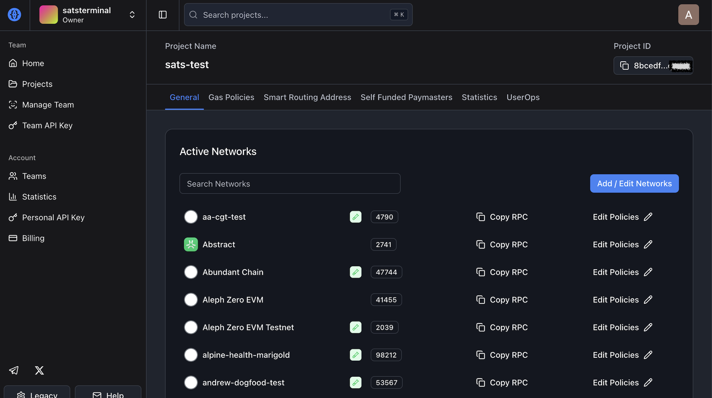

# satsterminal Recovery

Recovery UI for discovering and operating EVM ZeroDev Kernel loan wallets if satsterminal ceases to exist or the hosted service is unavailable.

Scope: EVM loans only. Solana loans are not supported.

This app is frontend-only:
- No backend signer
- No database
- No paymaster abstraction
- All signatures happen in your connected wallet

## What This App Does

- Derives deterministic ZeroDev Kernel v3.3 smart account addresses from your EOA + wallet index.
- Scans index ranges across chains to find deployed loan wallets.
- Reads balances + loan data from Aave and Morpho.
- Submits rescue actions through ERC-4337 UserOperations (EntryPoint v0.7):
  - Repay debt
  - Withdraw collateral
  - Transfer out collateral token balance

## Current Protocol/Chain Support

- Smart account: ZeroDev Kernel v3.3
- Chains: Ethereum (`1`), Base (`8453`), Arbitrum (`42161`), BNB Chain (`56`)
- Aave V3:
  - Reads + rescue actions on supported chains
- Morpho Blue:
  - Reads + rescue actions
  - Market ID: `0x9103c3b4e834476c9a62ea009ba2c884ee42e94e6e314a26f04d312434191836`

## Local Setup

### 1. Prerequisites

- Node.js `>=20`
- npm
- Browser wallet with EIP-1193 support (MetaMask, Rabby, etc.)
- Optional WalletConnect Project ID (only needed if you want WalletConnect in UI)

### 2. Install

```bash
npm install
cp .env.example .env.local
```

If you want WalletConnect support, set in `.env.local`:

```bash
NEXT_PUBLIC_WALLETCONNECT_PROJECT_ID=your_walletconnect_project_id
```

If you do not set this value, injected wallets still work.

No API key is required for onchain position reads.
You only need a ZeroDev project/bundler value when you want to submit rescue UserOperations.

### 3. Run

```bash
npm run dev
```

Open: `http://localhost:3000`

### 4. Optional verification

```bash
npm run lint
npm run build
```

## How To Use (Detailed)

### 1. Connect wallet

- You must export your private key from the Sats Terminal dashboard first.
- Import that private key into MetaMask/Rabby (or another EIP-1193 wallet), then connect that imported wallet to this recovery UI.
- Open the app.
- Connect that same imported EOA from the top-right wallet button.
- Do not connect a different wallet, or the derived wallet IDs/Kernel addresses will not match your loan.
- Never paste private keys into this recovery UI. Private keys should only be imported in your wallet application.

### 2. Discover wallet index (`/scan`)

- Go to `/scan`.
- Set:
  - `Start index`
  - `End index`
  - Chain checkboxes to scan
- Click **Start scan**.
- The app will request chain switches while scanning each chain.
- Click any result row to open `/wallet/<index>`.

Notes:
- Max scan size per run is `2,000` indices.
- Use **Show only deployed wallets** to filter noise.

You can skip scanning if you already know the wallet ID (index).
Open `/wallet/<wallet-id>` directly to access that exact loan wallet.
Example: `/wallet/12`

You receive this wallet ID in the loan activation email sent to your email address when your loan is completed/activated.

### 3. Open wallet details (`/wallet/<index>`)

- The page derives and displays the Kernel loan wallet address.
- Use **Copy address** and fund this smart wallet with:
  - Native gas token (required for all rescue actions)
  - Repay token (required for repay actions)
- Select chain in the chain dropdown if needed.
- Click **Load positions** to fetch:
  - Wallet balances
  - Aave loan details
  - Morpho loan details (Base market above)

### 4. Configure bundler input

- How to get your ZeroDev Project ID:
  - Open https://dashboard.zerodev.app/projects/general and sign in.
  - Open your project (or create one if none exists).
  - Copy the **Project ID** shown in the top-right of the project page.



- In **ZeroDev Project ID or RPC URL**, paste either:
  - A ZeroDev project ID, or
  - A full bundler URL (example: `https://rpc.zerodev.app/api/v3/<project-id>/chain/<chain-id>`)
- Rescue action buttons stay disabled until this input is valid.

### 5. Run rescue actions

#### Aave rescue actions

- Choose action: **Withdraw collateral** or **Repay debt**
- Choose full amount toggle or custom amount
- Click **Execute Aave action via Kernel**
- If using **Repay all**, keep a little extra loan token (for example USDC/USDT) in the loan/kernel wallet, because interest accrues in real time and debt can increase slightly before execution.

Behavior:
- Repay sends 2 UserOps:
  1. Approve repay token to pool
  2. Repay
- Withdraw sends 1 UserOp.

#### Morpho rescue actions

- Choose action: **Withdraw collateral** or **Repay debt**
- Choose full amount toggle or custom amount
- Click **Execute Morpho action via Kernel**
- If using **Repay all**, keep a little extra loan token (for example USDC/USDT) in the loan/kernel wallet, because interest accrues in real time and debt can increase slightly before execution.

#### Transfer out collateral balance

- In wallet balances section, click **Transfer all to connected wallet** for the collateral token card.

### 6. Confirm results

- Each action surfaces status text and a UserOp hash.
- Verify token balances and debt/collateral changes by clicking **Load positions** again.

## Operational Checklist

Before executing actions:
- Connected wallet is on the intended chain.
- Loan wallet has enough native gas token.
- Repay token is funded to the loan wallet for repay flows.
- Bundler input is set correctly.
- Amount + action are correct (especially full-withdraw/full-repay toggles).

## Troubleshooting

- `Switch your wallet to <chain>`:
  - Use chain selector and approve wallet switch prompt.

- Action button disabled:
  - Missing/invalid bundler input, invalid amount, or an action is already submitting.

- `No gas` warning:
  - Send native gas token to the loan wallet address shown on the page.

- Morpho USD fields show `—`:
  - Click **Load positions** again.
  - Check browser console for `Morpho summary fetch failed` to see exact read-path failure details.
  - Current logic tries:
    1. Public RPC read (backend-style)
    2. Wallet provider read fallback
    3. Raw onchain contract read fallback

- Scan is slow:
  - Reduce range size and/or number of selected chains.

## Project Layout

- `app/`: Next.js routes and UI
- `lib/kernel/`: deterministic Kernel address derivation
- `lib/accountAbstraction/`: UserOperation construction and submission
- `lib/protocols/`: Aave, Morpho, ERC-20, Kernel calldata helpers
- `lib/chains.ts`, `lib/assets.ts`: chain and token configuration

## Scripts

```bash
npm run dev
npm run build
npm run start
npm run lint
```

## Safety Notes

- Never paste or type private keys into this app.
- Always validate addresses, chain, and amounts before signing.
- You are fully responsible for transaction execution and operational safety.

## Disclaimer

This software is provided as-is, without warranties. You are responsible for validating transactions and operational safety before signing.

## License

MIT
